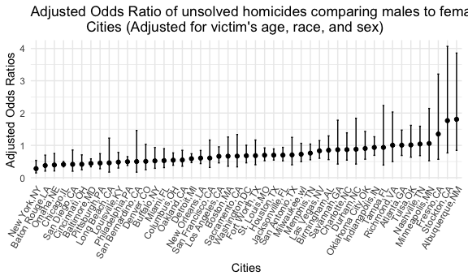
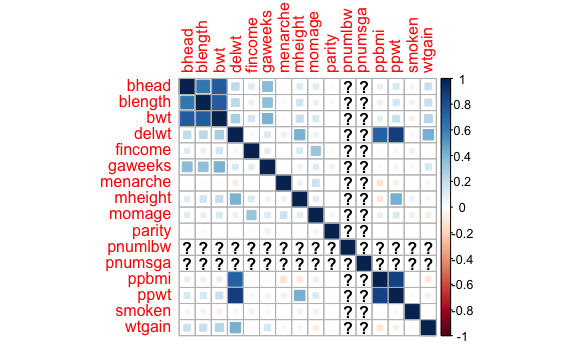
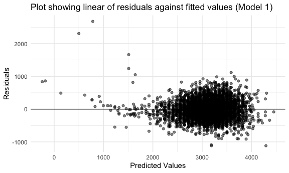
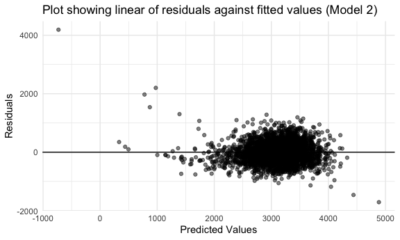
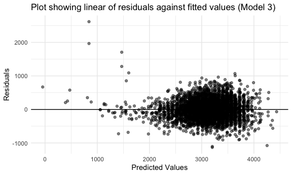
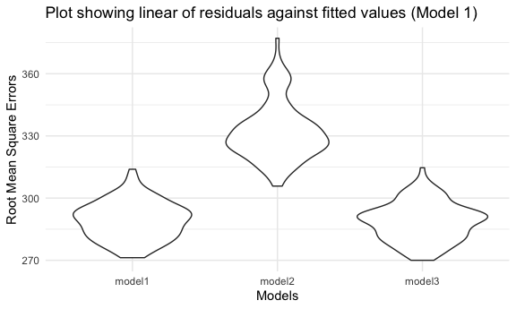

p8105_hw6_mbc2178
================
Melvin Coleman
11/23/2022

### Problem 1

### Problem 2

Let’s examine the Washington Post’s data on homicides in 50 large U.S.
cities. We will refer to this raw dataset as `homicide_df`.

``` r
homicide_df =
  read_csv('data/homicide-data.csv', col_names = TRUE) 
```

    ## Rows: 52179 Columns: 12
    ## ── Column specification ────────────────────────────────────────────────────────
    ## Delimiter: ","
    ## chr (9): uid, victim_last, victim_first, victim_race, victim_age, victim_sex...
    ## dbl (3): reported_date, lat, lon
    ## 
    ## ℹ Use `spec()` to retrieve the full column specification for this data.
    ## ℹ Specify the column types or set `show_col_types = FALSE` to quiet this message.

The `homicide_df` contains data from 50 large cities in the U.S. with 12
fields or variables and 52179 records or observations. This dataset
includes first and last names as well as ethnicity of homicide victims
(`victim_last`,`victim_first`, `victim_race`), dates of homicide report
(`reported_date`) and the status of cases characterized as closed with
arrest or closed without arrest (`disposition`). In addition, the
dataset also contains the longitude (`lon`) and latitude (`lat`) of the
cities where the homicide occurred.

Let’s perform some data cleaning and manipulation on `homicide_df` using
the `janitor::clean_names()` and `mutate`. We ensured that `victim_age`
is a numeric variable by using an `if_else` statement that would apply
NA to all missing values.

New variables `city_state` and a binary variable `homicide_solved` with
0 and 1 to indicate whether the homicide is solved were created. In
addition, we limit our analysis for those whose `victim_race` is white
or black and exclude the following cities Dallas,TX,Phoenix, AZ, and
Kansas City, MO because these don’t report victim race. Also, we omit
Tulsa,AL because it is a data entry mistake.

``` r
homicide_df =
  homicide_df %>% 
  janitor::clean_names() %>% 
  mutate(
    city_state = str_c(city,',',state),
    homicide_solved = if_else(disposition %in% c("Closed by arrest"), 1, 0),
   
   victim_age = ifelse(victim_age > 0, as.numeric(victim_age), NA)) %>% 
    
    filter(!city_state %in% c("Dallas,TX", "Phoenix, AZ", "Kansas City, MO","Tulsa,AL"),
           victim_race %in% c("White", "Black"),
           victim_sex %in% c("Male", "Female")) 
```

Let’s now fit a logistic regression with resolved vs unresolved as the
outcome and victim age, sex and race as predictors for the city of
Baltimore, MD.

``` r
baltimore_df = 
  homicide_df %>% 
  filter(city_state == "Baltimore,MD") %>% 
  select(victim_sex, victim_age, victim_race, homicide_solved, city_state) %>% 
  arrange(desc(homicide_solved))
```

Let’s run the logistic regression in this step:

``` r
logfit_baltimore = 
  baltimore_df %>% 
  glm(homicide_solved ~ victim_age + victim_race + victim_sex, data = ., family = binomial()) 
```

Let’s perform manipulations to obtain adjusted odds ratio estimates with
95% CI for solving homicides comparing male victims to female victims
keeping all other variables fixed.

``` r
logfit_baltimore %>% 
   broom::tidy() %>% 
  ## Exponentiate betas to obtain odds ratio & 95% CI
  mutate(
    log_OR = round(exp(estimate),3),
    CL_UpperLimit = round(exp(estimate + 1.96*std.error),3),
    CL_LowerLimit = round(exp(estimate - 1.96*std.error),3),
    term = str_replace(term, "^victim_sexMale", "Victim Sex: Male")) %>% 
  
     select(term, log_OR,CL_LowerLimit, CL_UpperLimit) %>% 
  
    filter(term == "Victim Sex: Male") %>% 
  rename('95%CI Upper Limit'= CL_UpperLimit ,
         '95%CI Lower Limit' = CL_LowerLimit,
         'Estimate' = log_OR,
          'Covariate' = term) %>% 
    knitr::kable(caption = "Table 1. Adjusted Odds Ratio for solving homicides <br>
                            (Adjusted for victim's age, race, and sex)", 
                            align = "cccc")
```

|    Covariate     | Estimate | 95%CI Lower Limit | 95%CI Upper Limit |
|:----------------:|:--------:|:-----------------:|:-----------------:|
| Victim Sex: Male |  0.443   |       0.337       |       0.583       |

Table 1. Adjusted Odds Ratio for solving homicides <br> (Adjusted for
victim’s age, race, and sex)

``` r
#### USE CONFINT to check if 95% CI calculations is correct 
```

Let’s run a regression model for each of the cities in our `homicide_df`
dataset and extract the adjusted odds ratio (and CI) for solving
homicides comparing male victims to female victims. We adjusted for
victim’s age, race, and sex. We use `purrr:map` and `nest` to create a
dataframe and apply the `glm` function to obtain estimated ORs and CIs
for each city.

``` r
cities_reg = 
  homicide_df %>% 
    nest(data = -city_state) %>% 
  mutate(
    models = map(data, ~glm(homicide_solved ~ victim_age + victim_race + victim_sex, data = .x, 
                            family = binomial())),
    results = map(models, broom::tidy)
  ) %>% 
     select(-data,-models) %>% 
       unnest(results) 
```

``` r
cities_fit = 
  cities_reg %>% 
## Exponentiate betas to obtain odds ratio & 95% CI
  mutate(
    log_OR = round(exp(estimate),3),
    CL_UpperLimit = round(exp(estimate + 1.96*std.error),3),
    CL_LowerLimit = round(exp(estimate - 1.96*std.error),3),
    term = str_replace(term, "^victim_sexMale", "Victim Sex: Male")) %>% 
  
     select(city_state, term, log_OR,CL_LowerLimit, CL_UpperLimit) %>% 
  
    filter(term == "Victim Sex: Male") %>% 
    arrange(city_state) 


cities_fit %>% 
rename( 'Cities' = city_state, 
        '95%CI UpperLimit'= CL_UpperLimit ,
        '95%CI LowerLimit' = CL_LowerLimit,
         'Estimate' = log_OR,
         'Covariate' = term) %>% 
  
   knitr::kable(caption = "Table 2. Adjusted Odds Ratio for solving homicides in 50 cities <br>
                            (Adjusted for victim's age, race, and sex)", 
                align = "ccccc")
```

|      Cities       |    Covariate     | Estimate | 95%CI LowerLimit | 95%CI UpperLimit |
|:-----------------:|:----------------:|:--------:|:----------------:|:----------------:|
|  Albuquerque,NM   | Victim Sex: Male |  1.807   |      0.846       |      3.857       |
|    Atlanta,GA     | Victim Sex: Male |  1.007   |      0.688       |      1.474       |
|   Baltimore,MD    | Victim Sex: Male |  0.443   |      0.337       |      0.583       |
|  Baton Rouge,LA   | Victim Sex: Male |  0.378   |      0.204       |      0.699       |
|   Birmingham,AL   | Victim Sex: Male |  0.851   |      0.560       |      1.294       |
|     Boston,MA     | Victim Sex: Male |  0.667   |      0.354       |      1.260       |
|    Buffalo,NY     | Victim Sex: Male |  0.521   |      0.290       |      0.935       |
|   Charlotte,NC    | Victim Sex: Male |  0.869   |      0.544       |      1.388       |
|    Chicago,IL     | Victim Sex: Male |  0.410   |      0.336       |      0.501       |
|   Cincinnati,OH   | Victim Sex: Male |  0.416   |      0.245       |      0.707       |
|    Columbus,OH    | Victim Sex: Male |  0.543   |      0.385       |      0.767       |
|     Denver,CO     | Victim Sex: Male |  0.506   |      0.247       |      1.034       |
|    Detroit,MI     | Victim Sex: Male |  0.589   |      0.467       |      0.742       |
|     Durham,NC     | Victim Sex: Male |  0.881   |      0.422       |      1.839       |
|   Fort Worth,TX   | Victim Sex: Male |  0.683   |      0.400       |      1.167       |
|     Fresno,CA     | Victim Sex: Male |  1.351   |      0.569       |      3.207       |
|    Houston,TX     | Victim Sex: Male |  0.698   |      0.546       |      0.892       |
|  Indianapolis,IN  | Victim Sex: Male |  0.936   |      0.692       |      1.268       |
|  Jacksonville,FL  | Victim Sex: Male |  0.699   |      0.520       |      0.938       |
|   Las Vegas,NV    | Victim Sex: Male |  0.831   |      0.601       |      1.149       |
|   Long Beach,CA   | Victim Sex: Male |  0.459   |      0.172       |      1.225       |
|  Los Angeles,CA   | Victim Sex: Male |  0.662   |      0.458       |      0.956       |
|   Louisville,KY   | Victim Sex: Male |  0.483   |      0.298       |      0.783       |
|    Memphis,TN     | Victim Sex: Male |  0.760   |      0.555       |      1.041       |
|     Miami,FL      | Victim Sex: Male |  0.529   |      0.312       |      0.898       |
|   Milwaukee,wI    | Victim Sex: Male |  0.727   |      0.496       |      1.064       |
|  Minneapolis,MN   | Victim Sex: Male |  1.060   |      0.525       |      2.143       |
|   Nashville,TN    | Victim Sex: Male |  1.043   |      0.683       |      1.592       |
|  New Orleans,LA   | Victim Sex: Male |  0.606   |      0.436       |      0.843       |
|    New York,NY    | Victim Sex: Male |  0.281   |      0.147       |      0.536       |
|    Oakland,CA     | Victim Sex: Male |  0.548   |      0.355       |      0.848       |
| Oklahoma City,OK  | Victim Sex: Male |  0.905   |      0.572       |      1.432       |
|     Omaha,NE      | Victim Sex: Male |  0.395   |      0.209       |      0.749       |
|  Philadelphia,PA  | Victim Sex: Male |  0.496   |      0.378       |      0.652       |
|   Pittsburgh,PA   | Victim Sex: Male |  0.453   |      0.276       |      0.744       |
|    Richmond,VA    | Victim Sex: Male |  1.006   |      0.498       |      2.033       |
|   Sacramento,CA   | Victim Sex: Male |  0.669   |      0.335       |      1.337       |
|  San Antonio,TX   | Victim Sex: Male |  0.705   |      0.398       |      1.249       |
| San Bernardino,CA | Victim Sex: Male |  0.500   |      0.171       |      1.462       |
|   San Diego,CA    | Victim Sex: Male |  0.414   |      0.200       |      0.857       |
| San Francisco,CA  | Victim Sex: Male |  0.608   |      0.317       |      1.165       |
|    Savannah,GA    | Victim Sex: Male |  0.867   |      0.422       |      1.780       |
|   St. Louis,MO    | Victim Sex: Male |  0.696   |      0.524       |      0.923       |
|    Stockton,CA    | Victim Sex: Male |  1.766   |      0.767       |      4.065       |
|     Tampa,FL      | Victim Sex: Male |  0.936   |      0.392       |      2.234       |
|     Tulsa,OK      | Victim Sex: Male |  1.014   |      0.635       |      1.620       |
|   Washington,DC   | Victim Sex: Male |  0.680   |      0.460       |      1.005       |

Table 2. Adjusted Odds Ratio for solving homicides in 50 cities <br>
(Adjusted for victim’s age, race, and sex)

Below we create a plot that shows the estimated ORs and CIs for each
city. The graph is organized by cities according to the estimated OR.

``` r
model_plot = 
  cities_fit %>% 
  arrange(log_OR) %>% 
  mutate(city_state = fct_reorder(city_state, log_OR)) %>% 
  
  ggplot(aes(x=city_state, y= log_OR)) + 
  geom_point() +
  
  ## Confidence Intervals 
  geom_errorbar(aes(ymin =CL_LowerLimit, ymax= CL_UpperLimit), width =.2, 
                position = position_dodge(0.05)) +
  
  ## Style format
labs(title = 
  "Adjusted Odds Ratio of unsolved homicides comparing males to females across U.S. 
              Cities (Adjusted for victim's age, race, and sex)") +
  xlab("Cities") +
  ylab("Adjusted Odds Ratios") +
  theme(axis.text.x = element_text(angle = 60, hjust = 1)) 

model_plot
```


Comment on the graph!!!!!!

### Problem 3

In this problem, we will analyze data gathered to understand the effects
of several variables on a child’s birthweight. Let’s load in our dataset
and call it `birthwt_df`.

``` r
birthwt_df = 
  read_csv("data/birthweight.csv") %>% 
  janitor::clean_names() %>% 
  
  ## convert numeric variables to factor 
  mutate(
    babysex = as.factor(babysex),
    mrace = as.factor(mrace),
    frace = as.factor(frace),
    malform = as.factor(malform)
  ) %>% 
  arrange()
```

    ## Rows: 4342 Columns: 20
    ## ── Column specification ────────────────────────────────────────────────────────
    ## Delimiter: ","
    ## dbl (20): babysex, bhead, blength, bwt, delwt, fincome, frace, gaweeks, malf...
    ## 
    ## ℹ Use `spec()` to retrieve the full column specification for this data.
    ## ℹ Specify the column types or set `show_col_types = FALSE` to quiet this message.

For this problem, we will fit a model to examine the relationship
between a child’s birthweight (`bwt`) and different factors. But in
order to see what’s correlated with our outcome and what factors we
could examine in our model, let’s create a correlation matrix. We
removed all the categorical variables to produce our correlation matrix.

``` r
 explo_df=
birthwt_df %>% 
  select(-babysex, -frace, -mrace, -malform)

corr_df= cor(explo_df)

corrplot(corr_df, method = "square")
```



From the correlation matrix, we observe a strong positive correlation
between baby’s birthweight measured in grams (`bwt`) , baby’s length at
birth measured in centimeters(`blength`) and baby’s head circumference
at birth measured in centimeters (`bhead`). In addition , there’s also a
fair positive correlation with gestational age in weeks (\`gaweeks),
mother’s weight gain during pregnancy (wtgain) and baby’s birthweight.

Based on the information provided above, to model birthweight, we will
examine the predictors `blength` and `bhead`. Let’s fit our proposed
model below.

``` r
### MODEL 1
fit = lm(bwt ~ blength + bhead, data= birthwt_df)

fit %>% 
  broom::tidy() %>% 
    select(term, estimate, p.value) %>% 
       mutate(term = str_replace(term, "^blength", "Baby's length"),
              term = str_replace(term, "^bhead", "Head circumference")) %>% 
          knitr::kable(digits = 3)
```

| term               |  estimate | p.value |
|:-------------------|----------:|--------:|
| (Intercept)        | -6029.620 |       0 |
| Baby’s length      |    85.030 |       0 |
| Head circumference |   146.021 |       0 |

Next, let’s run regression diagnostics on our proposed model using the
`modelr` package. We also produce graphics to visually inspect residuals
and fitted values.

``` r
diagnostics_df = 
birthwt_df %>% 
  select(bwt, blength, bhead) %>% 
  modelr::add_predictions(fit) %>% 
  modelr::add_residuals(fit)

diagnostics_df %>% 
  ## Let's make of residuals against fitted values
  ggplot(aes(x = pred, y = resid)) +
    geom_point(alpha = 0.5) +
   geom_hline(yintercept = 0) +
  
   ## Style format
labs(title = 
  "Plot showing linear of residuals against fitted values (Model 1) ") +
   xlab("Predicted Values") +
   ylab("Residuals")
```



From the graph above, we observe that our points/errors are randomly
distributed across our true mean and satisfies our assumptions. However,
it’s worth mentioning that there are a few outliers in our model and we
should be cautions about what steps we take to address them in our final
model.

Next, let’s compare our first model to two others: <br> - One using
length at birth and gestational age as predictors (main effects only)
<br> - One using head circumference, length, sex, and all interactions
(including the three-way interaction) between these.

However, let’s first fit our models and run diagnistics procedure on
these models.

``` r
## MODEL2 FIT & DIAGNOSTICS PROCEDURE

fit2 = lm(bwt ~ blength + gaweeks, data = birthwt_df)


model2_diagnostics_df = 
birthwt_df %>% 
  select(bwt, blength, gaweeks) %>% 
  modelr::add_predictions(fit2) %>% 
  modelr::add_residuals(fit2)

model2_diagnostics_df %>% 
  ## Let's make of residuals against fitted values
  ggplot(aes(x = pred, y = resid)) +
    geom_point(alpha = 0.5) +
   geom_hline(yintercept = 0) +
  
   ## Style format
labs(title = 
  "Plot showing linear of residuals against fitted values (Model 2) ") +
   xlab("Predicted Values") +
   ylab("Residuals")
```



``` r
## MODEL3 FIT & DIAGNOSTICS PROCEDURE

fit3 = lm(bwt ~ bhead + blength + babysex + bhead*blength*babysex, data = birthwt_df)

model3_diagnostics_df = 
birthwt_df %>% 
  select(bwt, bhead, blength, babysex) %>% 
  modelr::add_predictions(fit3) %>% 
  modelr::add_residuals(fit3)

model3_diagnostics_df %>% 
  ## Let's make of residuals against fitted values
  ggplot(aes(x = pred, y = resid)) +
    geom_point(alpha = 0.5) +
   geom_hline(yintercept = 0) +
  
   ## Style format
labs(title = 
  "Plot showing linear of residuals against fitted values (Model 3) ") +
   xlab("Predicted Values") +
   ylab("Residuals")
```



From the graphs above, we observe that our points/errors are also
randomly distributed across our true mean and satisfies our assumptions
with some outliers which could be of concern.

We make our comparison of all 3 models by using cross validation; making
use of `crossv_mc` and `purrr` packages. We first split our dataset into
training and testing datasets.

``` r
cv_df = 
  crossv_mc(birthwt_df, 100) 
```

Next, we compute root mean square errors (`rmse`) for each model. We
will use this value to select the best model fit.

``` r
cv_df = 
  cv_df %>% 
  mutate(
    ## MODEL 1
    model1 = map(train, ~lm(bwt ~ blength + bhead, data = .x)),
    
    ## MODEL 2
    model2=  map(train, ~lm(bwt ~ blength + gaweeks, data = .x)),
  
    ## MODEL 3
  model3=  map(train, ~lm(bwt ~ bhead + blength + babysex + bhead*blength*babysex, data = .x))
  ) %>% 
  
  mutate(
    rmse_model1 = map2_dbl(model1, test, ~rmse(model = .x, data = .y)),
    rmse_model2 = map2_dbl(model2, test, ~rmse(model = .x, data = .y)), 
    rmse_model3 = map2_dbl(model3, test, ~rmse(model = .x, data = .y)))
```

From the computation above, we now look at our results visually to
determine which model is the best fit given our data.

``` r
cv_df %>% 
  select(starts_with("rmse")) %>% 
  pivot_longer(
    everything(),
    names_to = "model", 
    values_to = "rmse",
    names_prefix = "rmse_") %>% 
  mutate(model = fct_inorder(model)) %>% 
  ggplot(aes(x = model, y = rmse)) + 
      geom_violin() +
  
    ## Style format
labs(title = 
  "Plot showing linear of residuals against fitted values (Model 1) ") +
   xlab("Models") +
   ylab("Root Mean Square Errors")
```



From the graph above, model1 and model3 appear to provide the best fit
for our data. However, I will lean more towards picking model3 because
it accounts for interaction and provides a good fit accounting for more
variables in our data.
